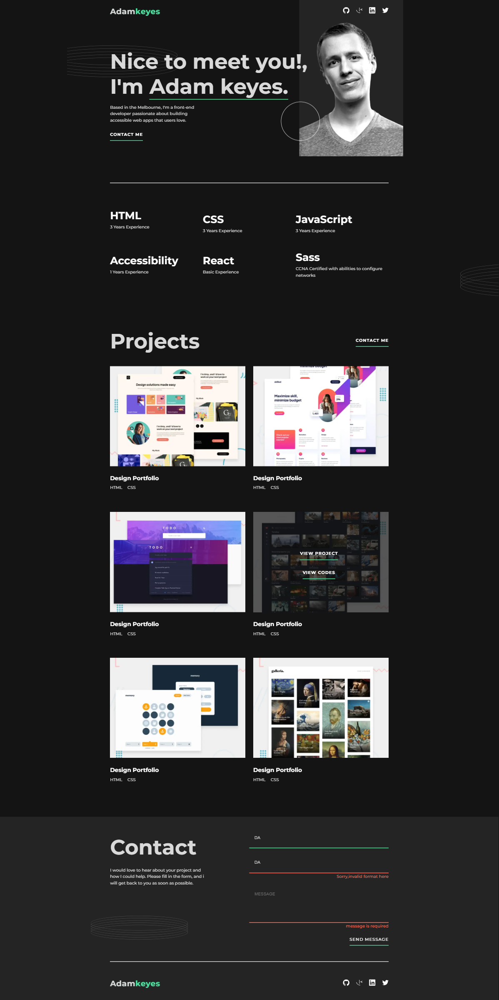
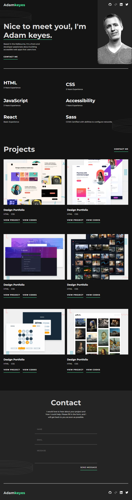

# Frontend Mentor - Single-page developer portfolio solution

This is a solution to the [Single-page developer portfolio challenge on Frontend Mentor](https://www.frontendmentor.io/challenges/singlepage-developer-portfolio-bBVj2ZPi-x). Frontend Mentor challenges help you improve your coding skills by building realistic projects.

## Table of contents

- [Overview](#overview)
  - [The challenge](#the-challenge)
  - [Screenshot](#screenshot)
- [My process](#my-process)
  - [Built with](#built-with)
  - [What I learned](#what-i-learned)
  - [Continued development](#continued-development)
- [Author](#author)

## Overview

Frontend Mentor Single Webpage Portfolio Challenge, creating a responsive portfolio webpage.

### The challenge

Users should be able to:

- Receive an error message when the `form` is submitted if:
  - Any field is empty
  - The email address is not formatted correctly
- View the optimal layout for the interface depending on their device's screen size
- See hover and focus states for all interactive elements on the page

- **Bonus**: Hook the form up so it sends and stores the user's enquiry (you can use a spreadsheet or Airtable to save the enquiries)
- **Bonus**: Add your own details (image, skills, projects) to replace the ones in the design

### Screenshot





## My process

- mainly started implementing mobile screen size styles at the begining, i used flexbox with grid.
- i used custome css properties to set properties value depending in which section is being defined.
- the hard part was implementing the hover effect on each individual project.
- used javascript to validate the form inputs.

### Built with

- Semantic HTML5 markup
- CSS custom properties
- Flexbox
- CSS Grid
- Mobile-first workflow

### What I learned

- I have learnt how to apply custome css properties depending in which block scope is defined.
- How to validate form input fields on typing using Javascript.

```html
<section class="hero-section | auto-flex">
  <div></div>
</section>
<h1>Some HTML code I'm proud of</h1>
```

```css
.auto-flex {
  display: flex;
  flex-direction: var(--flex-direction, row);
}
.hero-section {
  --flex-direction: column;
}
```

```js
const proudOfThisFunc = () => {
  console.log('🎉');
};
```

### Continued development

- dive deeper into advanced css concepts, and how to utilise the power of css grid and flexbox
- continue learning Javascript.

## Author

#### DANIEL DENKHA

- Frontend Mentor - [@Korg01wfd](https://www.frontendmentor.io/profile/Korg01wfd)
